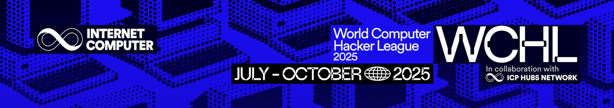

<div align="center"> 
	<a href="https://dorahacks.io/hackathon/wchl25-qualification-round/buidl" target="_blank">
		 
	</a>
</div>


<div align="center"> 
	
	by:  
	<a href="https://dashboard.dorahacks.io/org/3872" target="_blank">
		 
	</a>
</div>

# SplitSafe
A decentralized, trustless escrow and split payment system using Internet Computer (ICP) with Bitcoin integration and SEI Network for fast transactions. It utilizes ICP's native Bitcoin integration via cKBTC (Chain-Key Bitcoin) for secure Bitcoin escrow and SEI's high-performance blockchain for rapid transaction processing, eliminating the need for bridges, wrapped tokens, or intermediaries.

Senders can lock cKBTC into escrow, define payout rules, and automatically release funds once the specified conditions are met. Recipients receive tokens in predefined split proportions, which can be converted to native Bitcoin through ICP's Bitcoin integration or processed via SEI Network for faster settlements, all managed by canister logic on the Internet Computer.

**Technology Stack:**
- **Bitcoin (cKBTC → BTC)**: Native Bitcoin integration via ICP for secure escrow
- **SEI Network**: High-performance blockchain for fast transaction processing
- **Withdrawal System**: Multi-asset withdrawal support (ICP, cKBTC, SEI)
- **AI Assistant (Beta)**: Intelligent support for transfers and decision making
- **Reputation System (Beta)**: Trust-based scoring mechanism for user verification
- **Testnet Ready**: Atlantic-2 testnet integration for safe development

Use cases for SplitSafe include freelance payments, DAO treasuries, milestone-based bounties, marketplace transactions, gaming payments, DeFi integrations, and any scenarios requiring trust-minimized Bitcoin escrow with fast settlement options.

<div align="center"> 
	 
	 
	 
	 
	 
	 
	 
	 
	 
</div>
<div align="center"> 
  
  
  
	 
</div>

<div align="center"> 
	 
	 
	 
</div>

<div align="center"> 
	 
	 
	 
</div>

## 🎥 Demo Videos

### Qualification Round Demo
Watch our complete demo showcasing SafeSplit's trustless Bitcoin escrow functionality:  
[](https://www.loom.com/share/6048358153c04dae899d0b2902f2fd9e?sid=d9b720fa-452b-4e3c-903b-1cf0f0856a20)

**Features demonstrated:**
- ✅ Complete escrow lifecycle (create → approve → release)
- ✅ Bitcoin escrow via cKBTC with native BTC conversion
- ✅ Sender initiate escrow BTC gets hold
- ✅ Sender cancellation with full refund
- ✅ Recipient decline and approve
- ✅ Transaction history and status tracking
- ✅ Modern, intuitive user interface

### National Round Demo  
Watch our complete demo showcasing SafeSplit's Sei Layer 1 and AI agent assistant:  
[](https://drive.google.com/file/d/1KpHyDtBPuyweP59vSKcmehHkay5sF7H8/view?usp=sharing)

**Features demonstrated:**
- ✅ SEI Layer 1 Network integration for fast transaction processing
- ✅ Real-time balance management
- ✅ ICP and cKBTC withdrawal support
- ✅ AI Assistant for navigating routes
- ✅ AI Assistant for initiate escrow
- ✅ AI Assistant for decision making
- ✅ Sender can edit escrow amount, title and recipients
- ✅ Reputation system with fraud detection
- ✅ Call limiting and access control
- ✅ Escrow auto cancel within 24 hours if no action taken

### Regional Round Demo  
**Coming in Regional Round:**
- 🔄 Withdrawal support (SEI)
- 🔄 AI Assistant for withdrawal
- 🔄 Sei and ckBTC fee will show up in summary
- 🔄 and so much more...

### Global Round Demo  
**Coming in Global Round:**
- 🔄 Advanced analytics dashboard
- 🔄 Own API for third-party integrations and documentation
- 🔄 and so much more...


---

## Quick Start
```bash
nvm use

# These are IC network values
cp .env.example .env

# Install dependencies
npm install

# Start development server
npm run dev
```
The application will be available at http://localhost:3000  

### Set BTC balance testnet 
```bash
./scripts/balance-scripts/set-bitcoin-balance.sh <YOUR_BROWSER_PRINCIPAL> 100000000 ic  # Add 1 BTC
./scripts/balance-scripts/get-user-bitcoin-balance.sh <YOUR_BROWSER_PRINCIPAL> ic
```

### Direct set balance of btc
```bash
# Check your current principal
dfx identity get-principal

# Add 1 BTC balance for your principal
# First principal: Admin principal (replace with your admin principal)
# Second principal: Your browser principal (replace with your actual browser principal)
dfx canister --network ic call split_dapp addBitcoinBalance "(principal \"YOUR_ADMIN_PRINCIPAL\", principal \"YOUR_BROWSER_PRINCIPAL\", 100_000_000)"

# Verify the balance (using your browser principal)
dfx canister --network ic call split_dapp getUserBitcoinBalance "(principal \"YOUR_BROWSER_PRINCIPAL\")"
```

## 🧪 Testing

### E2E Integration Tests
After deployment, you can run the following end-to-end integration tests:

```bash
# Test withdrawal functionality (ICP and ckBTC)
./scripts/tests/test-withdraw.sh <YOUR_BROWSER_PRINCIPAL> local  # LOCAL NETWORK
./scripts/tests/test-withdraw.sh <YOUR_BROWSER_PRINCIPAL> ic     # IC NETWORK

./scripts/tests/test-decline-split.sh <YOUR_BROWSER_PRINCIPAL> ic  
./scripts/tests/test-cancel-split.sh <YOUR_BROWSER_PRINCIPAL> ic  
./scripts/tests/test-release-split.sh <YOUR_BROWSER_PRINCIPAL> ic  
./scripts/tests/test-sei-testnet.sh <YOUR_BROWSER_PRINCIPAL> ic  

./scripts/tests/run-all-tests.sh <YOUR_BROWSER_PRINCIPAL> ic
```

### Test Data Seeding
To populate the canister with test escrow transactions for development and testing:

```bash
# Run all seeder scripts to create sample escrows
./scripts/seeders/run-all-seeders.sh <YOUR_BROWSER_PRINCIPAL>

# Or run individual seeders:
./scripts/seeders/initiate-escrow-only.sh <YOUR_BROWSER_PRINCIPAL> 
./scripts/seeders/initiate-and-approve.sh <YOUR_BROWSER_PRINCIPAL> 
./scripts/seeders/initiate-and-decline.sh <YOUR_BROWSER_PRINCIPAL> 
./scripts/seeders/initiate-and-cancel.sh <YOUR_BROWSER_PRINCIPAL>  

# Example usage:
./scripts/seeders/run-all-seeders.sh <YOUR_BROWSER_PRINCIPAL> 
```
**Note:** Seeders automatically set up balances and create realistic test scenarios for each escrow lifecycle state.


## 🚀 **Live on Internet Computer Mainnet**

### **v1 Canister Deployment**
Your SafeSplit app is now live on the Internet Computer mainnet!

**Canister IDs:**
- **split_dapp**: `efzgd-dqaaa-aaaai-q323a-cai` (Main application logic)
- **frontend**: `ecyax-oiaaa-aaaai-q323q-cai` (Web interface)
- **ckbtc_ledger**: `el3ll-yaaaa-aaaai-q322a-cai` (Bitcoin ledger)
- **ckbtc_minter**: `em2n7-vyaaa-aaaai-q322q-cai` (Bitcoin minter)

**Access Your App:**
- **IC URL**: `https://ecyax-oiaaa-aaaai-q323q-cai.ic0.app`
- **Custom Domain**: `thesafesplit.com` (coming soon)

### **v1 Features Available:**

| Category | Feature | Status | Description |
|----------|---------|--------|-------------|
| **Core Escrow** | Trustless Bitcoin Escrow | ✅ Live | Lock cKBTC into escrow with predefined conditions |
| | Multi-Recipient Splits | ✅ Live | Distribute funds to multiple recipients with custom percentages |
| | Conditional Release | ✅ Live | Automatic fund release when all recipients approve |
| | Cancellation & Refunds | ✅ Live | Sender can cancel escrow and get full refund |
| | Recipient Actions | ✅ Live | Approve or decline escrow participation |
| **ckBitcoin Integration** | Native cKBTC Support | ✅ Live | Direct Bitcoin integration via ICP's Chain-Key Bitcoin |
| | BTC Conversion | ✅ Live | Convert cKBTC to native Bitcoin through ICP |
| | Secure Escrow | ✅ Live | Bitcoin held securely in canister-controlled escrow |
| | Real-time Balances | ✅ Live | Live cKBTC balance tracking |
| **SEI** | SEI Network | ✅ Live | High-performance blockchain for fast transaction processing |
| | Testnet Ready | ✅ Live | Atlantic-2 testnet integration for safe development |
| **AI Assistant** | Intelligent Support | ✅ Live | AI-powered assistance for escrow creation |
| | Natural Language | ✅ Live | Chat-based interface for complex operations |
| | Decision Making | ✅ Live | AI suggestions for optimal escrow configurations |
| | Route Optimization | ✅ Live | Smart recommendations for transaction routing |

### **Use Cases Supported:**
- **Freelance Payments**: Secure milestone-based payments
- **DAO Treasuries**: Multi-signature fund management
- **Marketplace Transactions**: Escrow for goods and services
- **Gaming Payments**: Secure in-game asset transfers
- **DeFi Integrations**: Cross-chain liquidity management
- **Bounty Systems**: Automated reward distribution


## Authors

- [@kenn](https://www.linkedin.com/in/kdst/)
- [@don](https://www.linkedin.com/in/carl-john-don-sebial-882430187/)
- [@peter](https://www.linkedin.com/in/petertibon/)
